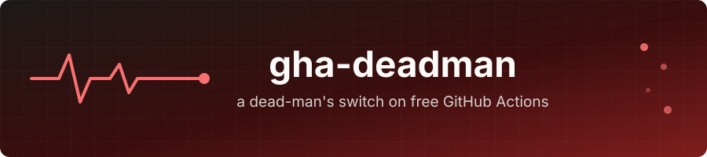

  

# gha-deadman

A dead-man's switch that runs entirely on free GitHub Actions. It probes a URL
every 10 minutes from GitHub's infrastructure — outside your network, outside
your monitoring stack — and messages you on Telegram when the URL stops
answering, hourly while it stays down, and once when it recovers.

The typical use case: you run a monitoring server (Uptime Kuma, Prometheus,
whatever) that alerts you when things break. But who alerts you when the
*monitoring server* breaks? Point gha-deadman at any URL that is only healthy
while your watcher is healthy — a status page is perfect — and the circle is
closed, with zero infrastructure and zero cost.

## How it works

- `.github/workflows/deadman.yml` runs on a `*/10` cron on GitHub-hosted
  runners (free and unlimited on public repositories).
- `scripts/check.sh` probes `TARGET_URL` (2 attempts, 25 s apart, so a single
  network blip doesn't page you) and talks to the Telegram Bot API directly —
  no third-party actions, no dependencies beyond `curl`, `jq` and `gh`.
- **Stateless by design**: the workflow's own run history is the state. A
  failing probe exits non-zero, so the previous run's conclusion says whether
  the target was already down, the streak of consecutive red runs drives the
  re-alert cadence, and the oldest red run's timestamp gives the outage
  duration. Nothing is stored anywhere, and the run history doubles as an
  outage log. (This also sidesteps a real limitation: the workflow
  `GITHUB_TOKEN` cannot write repository Actions variables.)
- Alert policy: one message on the up→down transition, a reminder every hour
  while down, one message on recovery with the outage duration. Steady state
  sends nothing.
- A separate weekly `keepalive.yml` re-enables both workflows via the GitHub
  API so the schedules survive GitHub's 60-day inactivity auto-disable —
  separate on purpose, so its green runs never pollute the probe's history.

## Setup

1. Fork or copy this repository (public, so the Actions minutes are free).
2. Create a Telegram bot with [@BotFather](https://t.me/BotFather), and get
   your chat id (send the bot a message, then check
   `https://api.telegram.org/bot<TOKEN>/getUpdates`).
3. Add three repository secrets (Settings → Secrets and variables → Actions):

   | Secret | Value |
   |---|---|
   | `TARGET_URL` | The URL to probe. Any HTTP 2xx/3xx counts as alive; pick a dynamic, uncacheable endpoint so a CDN can't answer for a dead origin. |
   | `TELEGRAM_BOT_TOKEN` | The bot token from BotFather. |
   | `TELEGRAM_CHAT_ID` | Your numeric chat id. |

4. Run the `deadman` workflow once by hand (Actions → deadman → Run workflow)
   to confirm the happy path, and once with `TARGET_URL` pointed at something
   dead to confirm the alert actually fires. An alert you have never seen fire
   is not an alert.

## Tuning

Environment knobs in `scripts/check.sh` (override in the workflow if needed):

| Variable | Default | Meaning |
|---|---|---|
| `PROBE_ATTEMPTS` | `2` | Failed attempts required to call it down |
| `PROBE_RETRY_DELAY` | `25` | Seconds between attempts |
| `PROBE_TIMEOUT` | `20` | Per-attempt timeout in seconds |
| `REALERT_EVERY_RUNS` | `6` | Reminder every N red runs (6 × 10 min cron ≈ hourly) |
| `WORKFLOW_FILE` | `deadman.yml` | Workflow whose run history is read as state |

Note that GitHub cron is best-effort: expect occasional multi-minute delays,
which is fine for a dead-man's switch with a 20-minute detection floor.

## License

GPL-3.0 — see [LICENSE](LICENSE).
